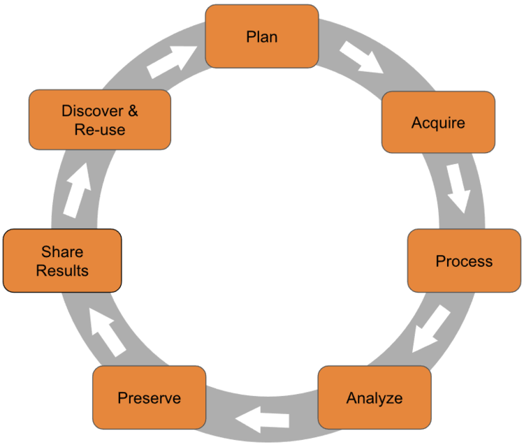

::::::::::::::::::::::::::::::::::::::: objectives

- Define "research data" and "research data management"
- Explain why good data management matters for you, your research group, and the wider community
- Recognise the consequences of poor data management

::::::::::::::::::::::::::::::::::::::::::::::::::

:::::::::::::::::::::::::::::::::::::::: questions

- What is research data and why should I care about managing it?
- What can go wrong if I don't manage my data well?
- What is the reproducibility crisis and how does it relate to data management?

::::::::::::::::::::::::::::::::::::::::::::::::::

## What Is Research Data?

When you hear "research data", you might think of a spreadsheet of results or a graph.
In practice, research data includes everything generated or collected during
a research project that is needed to validate your findings. In chemistry,
this might include:

- Raw instrument output (NMR FIDs, mass spectra, IR interferograms, diffraction patterns)
- Processed spectra and images
- Lab notebook entries (paper or electronic)
- Synthesis protocols and reaction conditions
- Computational input and output files (DFT calculations, molecular dynamics trajectories)
- Code and scripts used for analysis
- Photographs, videos, and microscopy images
- Sample metadata (batch numbers, purities, supplier information)
- Calibration data and instrument logs

**Research data is not just the final polished dataset attached to a publication, it is the full trail of evidence behind your conclusions.**

## What Is Research Data Management?

**Research data management (RDM)** is the organisation, storage, preservation,
and sharing of data collected and used during a research project. It covers
the entire **research data lifecycle**:

{alt="A circular diagram showing the stages of the research data lifecycle: Plan, Collect, Process and Analyse, Store, Share and Preserve, Reuse."}

Good RDM means thinking about your data at every stage — not just when a
journal asks you to upload a supporting dataset.

:::::::::::::::::::::::::::::::::::::::::  callout

## The Research Data Lifecycle

The research data lifecycle is a useful way to think about when and how data
management decisions need to be made. Different models use slightly different
labels, but the stages are broadly the same:

1. **Plan** — Before you start: what data will you generate? How will you
   organise, store, and share it?
2. **Collect** — Gather or generate data, recording metadata as you go.
3. **Process and analyse** — Clean, transform, and analyse data, keeping
   records of every step.
4. **Store** — Keep data safe, backed up, and well-organised during the
   active project.
5. **Share and preserve** — Deposit data in a repository, apply a licence,
   and ensure long-term preservation.
6. **Reuse** — Your data (and others') can be found, accessed, and built
   upon by future researchers.

This workshop follows the lifecycle. Part 1 covers the general principles
at each stage; Part 2 applies them to chemistry-specific scenarios.

::::::::::::::::::::::::::::::::::::::::::::::::::

## Why Does It Matter?

Good data management is not just a bureaucratic requirement. It directly
affects:

- **Your future self.** Will you be able to find, understand, and reuse
  your own data in six months? Three years?
- **Your research group.** Can a new PhD student pick up where a former
  group member left off?
- **Reproducibility.** Can other researchers verify and build on your work?
- **Compliance.** Most funders (including EPSRC and UKRI) now require
  data management plans and open data sharing.
- **Efficiency.** Time spent searching for files, re-running experiments,
  or reconstructing lost data is time not spent on research.

## What Happens When It Goes Wrong

Data management failures are more common than you might think, and the
consequences range from inconvenient to career-damaging.

### The Unreadable Tapes

A major social science research group spent years and significant funding
collecting a valuable dataset. The data was stored on magnetic tapes — the
standard medium at the time. Years later, when researchers wanted to reuse
the data, the institution no longer had hardware capable of reading those
tapes. The dataset was effectively lost, along with the investment of time
and money that went into collecting it.

:::::::::::::::::::::::::::::::::::::::::  callout

## Format Obsolescence

Proprietary instrument formats, old versions of software, and unsupported file types can all make data
inaccessible over time. Saving your data in open, standard formats alongside
vendor-specific formats is one of the simplest things you can do to protect
against this.

::::::::::::::::::::::::::::::::::::::::::::::::::

### The Retraction Cascade

A 2024 study in *Royal Society Open Science* analysed article retractions
caused by data management errors. The researchers found that since 2000,
data-related retractions have risen sharply — with data problems accounting
for over 75% of retractions in 2023. The most common causes were incorrect
data processing, data coding errors, and loss of documentation or materials.

Critically, retracted papers continue to be cited: the study found thousands
of citations to retracted papers, many of which occurred *after* the
retraction notice was published.

> Williams et al. (2024) "Opening the black box of article retractions:
> exploring the causes and consequences of data management errors."
> *Royal Society Open Science.*
> [doi:10.1098/rsos.240844](https://royalsocietypublishing.org/doi/10.1098/rsos.240844)

### The Overwritten Dataset

A PhD student generates raw mass spectrometry data for a key series of
compounds. Under time pressure, they process the data and save the processed
files over the originals — overwriting the raw data. Months later, they
discover an error in their processing pipeline. Without the raw data, there
is no way to recover. The experiments must be repeated from scratch, costing
months of work.

This kind of scenario is avoidable with simple practices: keep raw data
read-only, use consistent file naming, and follow the 3-2-1 backup rule (more
on this in a later episode).

## The Reproducibility Crisis

In 2016, the journal *Nature* surveyed over 1,500 researchers about
reproducibility. The findings were striking:

- Over **70%** of researchers had tried and failed to reproduce another
  scientist's experiments
- More than **half** had failed to reproduce their own experiments
- Chemists had the **highest proportion** of respondents who had been unable
  to reproduce someone else's experiment

Despite this, most researchers still trusted published results and this
confidence was most pronounced among chemists and physicists.

> Baker, M. (2016) "1,500 scientists lift the lid on reproducibility."
> *Nature*, 533, 452–454.
> [doi:10.1038/533452a](https://www.nature.com/articles/533452a)

The causes identified by respondents included pressure to publish, selective
reporting, insufficient methods detail, and poor data management. Many of
these are directly addressable through better RDM practices, which is
exactly what this workshop is about.

:::::::::::::::::::::::::::::::::::::::::  callout

## Reproducibility in Chemistry

We will return to the reproducibility crisis in more detail in Part 2 of
this workshop
([Episode 6: The Reproducibility Crisis in Chemistry](06-reproducibility-in-chemistry.md)),
where we look at chemistry-specific challenges and what the community is
doing about them.

::::::::::::::::::::::::::::::::::::::::::::::::::

## The Good News

Good data management is not difficult. It requires some upfront thought and
a few consistent habits, but the payoff is enormous: less time wasted, fewer
mistakes, better science, and compliance with funder and publisher
requirements. The rest of this workshop will give you the practical tools to
get there.

:::::::::::::::::::::::::::::::::::::::  challenge

## Challenge 1: Data Audit

Take 2 minutes to list all the different
types of data you produce or use in your research. Think broadly:

- Raw data files from instruments
- Processed or analysed data
- Lab notebook entries
- Code and scripts
- Images and figures
- Metadata (sample details, instrument settings)
- Documentation (protocols, README files)
- Any other digital or physical records

Once you have your list, share it with your neighbour (or breakout room
partner). Did they mention any types you missed?

:::::::::::::::  solution

## Discussion

There is no single right answer — the goal is to recognise how many
different forms research data can take. Common items that people overlook
include:

- Instrument calibration files and logs
- Email correspondence about experimental details
- Handwritten notes that never get digitised
- Negative or failed results that don't make it into publications
- Software versions and environment configurations
- Sample provenance information (supplier, batch, purity)

**If your list is short, that might indicate data types you are generating but not actively managing, and those are exactly the gaps that good RDM practices can fill.**

:::::::::::::::::::::::::

::::::::::::::::::::::::::::::::::::::::::::::::::

:::::::::::::::::::::::::::::::::::::::: keypoints

- Research data includes everything needed to validate your findings — not just the final published dataset.
- Research data management covers the full lifecycle: planning, collecting, storing, sharing, and preserving data.
- Poor data management leads to data loss, retractions, wasted time, and irreproducible research.
- The reproducibility crisis is real and affects chemistry — but good RDM practices directly address its root causes.
- Good data management is not difficult; it requires some upfront planning and consistent habits.

::::::::::::::::::::::::::::::::::::::::::::::::::
